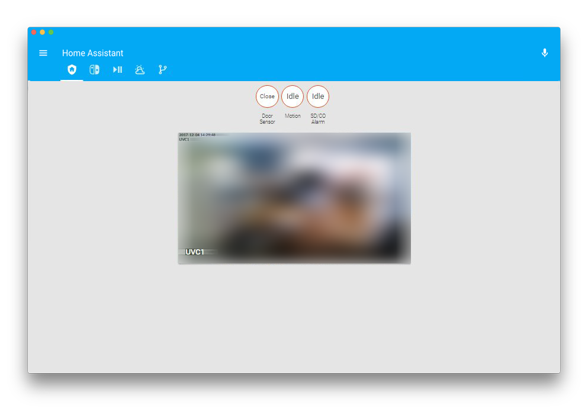
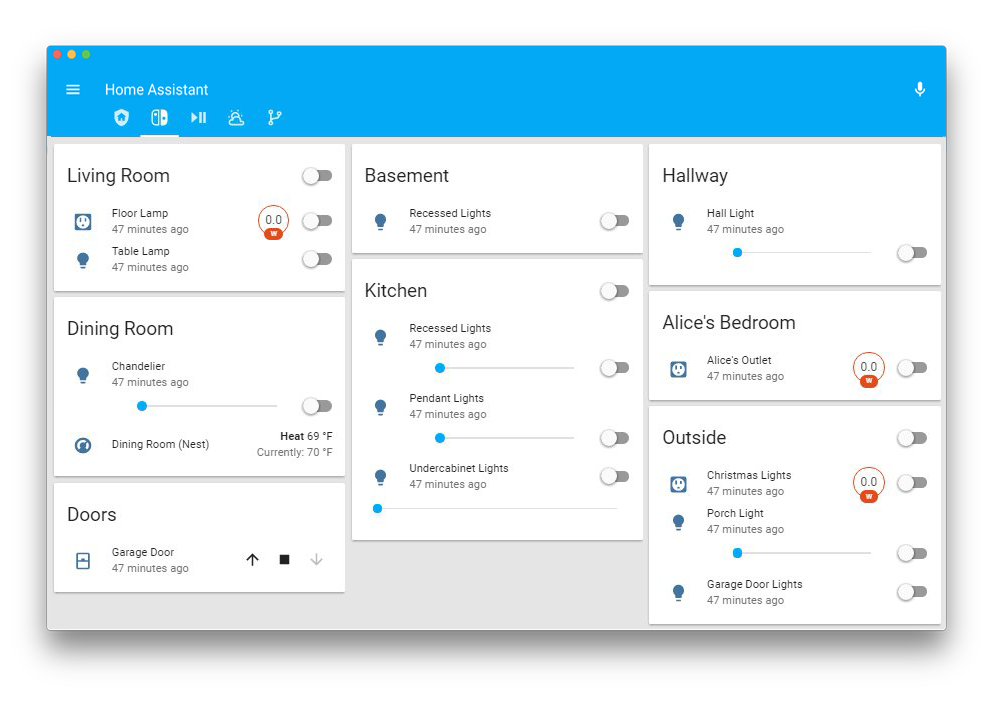
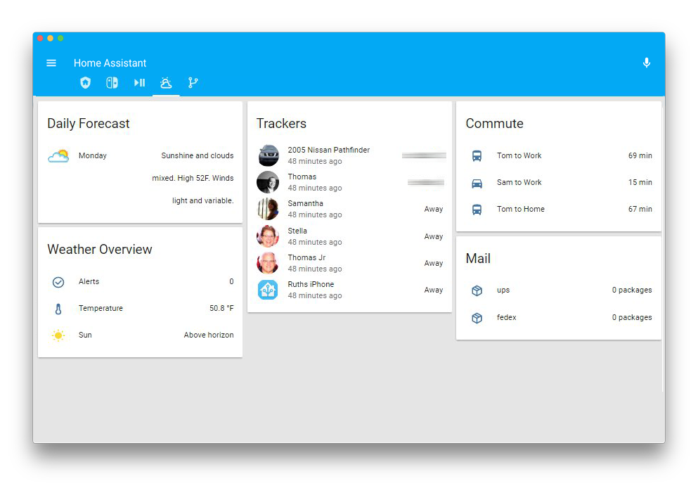

# Home Assistant Config

This is my [Home Assistant](https://home-assistant.io) configuration.

## Devices

- [Aeotec Z-Stick Gen5](http://a.co/cwks2LC) x1
- [Aeotec Smart Switch ZW096](http://a.co/fO24EDW) x3
- [Aeotec Nano Dimmer ZW111](http://a.co/csfRC1j) x1
- [Aeotec MultiSensor 6 ZW100](http://a.co/cqqP7GO) x1
- [First Alert SD/CO ZCOMBO-G](http://a.co/3VpyzEV) x1
- [Logitech Harmony Companion](http://a.co/8A3G69r) x1
- [Unifi UVC-Micro](http://a.co/66U30Pv) x1
- Need to update with more devices

## Screenshots

## Todo List

I've moved this entire section to the [issues section](https://github.com/tscibilia/HASSIO-Config/issues) on github.

**All files are now being edited with [Atom](https://atom.io/).**